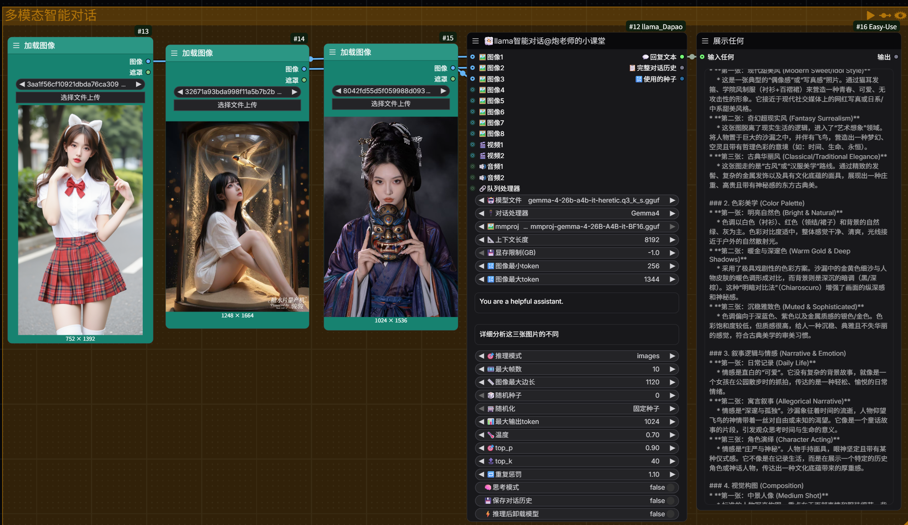
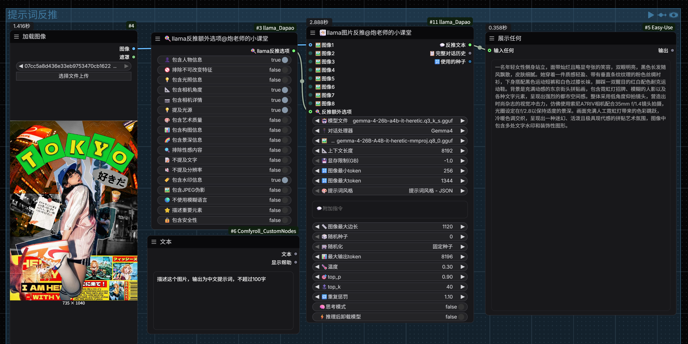
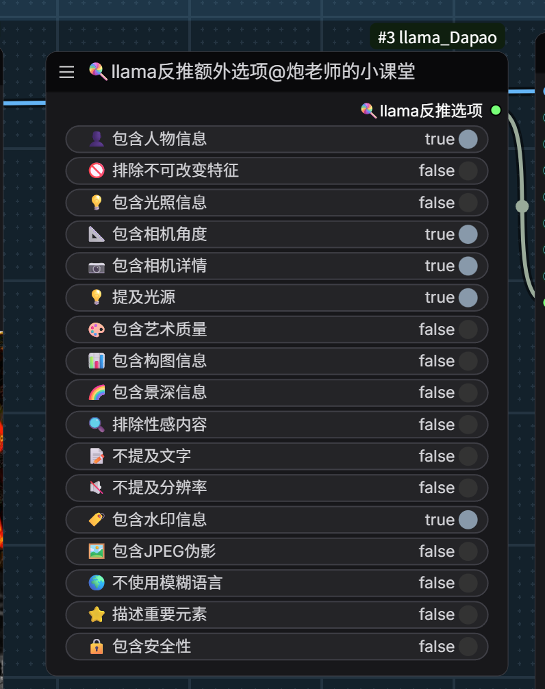
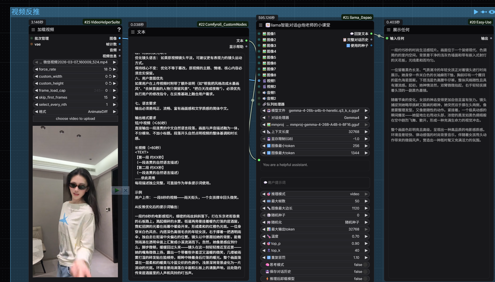

# ComfyUI-llama_Dapao

基于 llama-cpp-python 的 ComfyUI 本地大语言模型推理节点，支持多种视觉语言模型，一个节点搞定模型加载 + 参数配置 + 对话推理。

## 节点列表

### 😶‍🌫️ llama智能对话

多模态对话节点，支持文本、图像、视频、音频输入。

- 支持 8 张图像 + 2 个视频 + 2 个音频同时输入
- 多轮对话历史保持（可开关）
- 思考模式开关（Qwen/GLM/Gemma4 等支持思考的模型）
- 自动 VRAM 分配，支持手动限制显存
- 推理后可选卸载模型释放显存


### 😶‍🌫️ llama图片反推

图像描述/反推提示词节点，内置多种提示词风格模板。

- 提示词风格从 `prompt/` 文件夹动态加载，支持用户自定义
- 附加指令优先：填写了附加指令则覆盖内置风格
- 支持 1-8 张图像批量反推
- 可搭配「反推额外选项」节点精细控制输出


### 🍭 llama反推额外选项

为图片反推节点提供 17 项可选增强指令，包括：

人物信息、光照描述、相机角度/参数、构图分析、景深、艺术质量评价、安全性评级等。勾选后自动附加到反推提示词中。


### 🍭 llama视频反推


## 支持的模型/处理器

| 处理器 | 说明 |
|--------|------|
| None | 纯文本模型，无需 mmproj |
| LLaVA-1.5 / 1.6 | LLaVA 系列视觉模型 |
| Moondream2 | 轻量视觉模型 |
| MiniCPM-v2.6 / v4.5 | MiniCPM 视觉模型 |
| Gemma3 / Gemma4 | Google Gemma 视觉模型 |
| Qwen2.5-VL / Qwen3-VL | Qwen 视觉模型 |
| Qwen3.5 | Qwen3.5 多模态模型 |
| GLM-4.6V / GLM-4.1V | 智谱 GLM 视觉模型 |
| LFM2-VL | Liquid 视觉模型 |
| Granite-Docling | 文档理解模型 |

带 `-Thinking` 后缀的处理器默认开启思考模式。

## 安装

### 1. 安装 llama-cpp-python（GPU 版本）

**不要** 用 `pip install llama-cpp-python` 安装 CPU 版本，GPU 推理速度差异极大。

从 [JamePeng/llama-cpp-python](https://github.com/JamePeng/llama-cpp-python/releases) 下载对应 CUDA 版本的预编译 wheel：

```bash
# 示例：CUDA 12.8，Python 3.11，Windows
pip install llama_cpp_python-0.3.35+cu128-cp311-cp311-win_amd64.whl
```

最低版本要求：`0.3.35+`（支持 Gemma4、LFM2-VL 等新架构）

### 2. 模型文件

将 GGUF 模型文件放到 `ComfyUI/models/LLM/` 目录下，节点会自动扫描。

视觉模型需要同时放入对应的 mmproj 文件（文件名包含 `mmproj`）。

## 自定义反推提示词

插件目录下的 `prompt/` 文件夹存放反推提示词模板：

```
ComfyUI-llama_Dapao/
  prompt/
    提示词风格 - 标签.txt
    提示词风格 - 简单.txt
    提示词风格 - 详细.txt
    ...
```

原节点引自：https://github.com/lihaoyun6/ComfyUI-llama-cpp_vlm